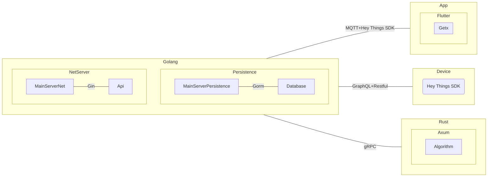

# Database Table


## users
```sqlite
create table users
(
    id       integer
        primary key
        constraint fk_notifications_receiver
            references notifications,
    name     text,
    password text,
    email    text
        unique,
    token    text
);
```

## tasks
```sqlite
create table tasks
(
    id             integer
        primary key,
    name           text,
    user_id        integer -- 任务的所有者
        constraint fk_tasks_user
            references users
            on update cascade on delete set null,
    pre_task_of_id integer -- 作为谁的前置任务
        constraint fk_tasks_pre_tasks
            references tasks,
    sub_task_of_id integer -- 作为谁的子任务
        constraint fk_tasks_sub_tasks
            references tasks
);
```

## devices
```sqlite
create table devices
(
    id                 integer
        primary key,
    name               text,
    hey_things_sdk_sim text,
    exclusive          numeric,
    occupied           numeric
);
```

## device_task_relations
```sqlite
create table device_task_relations
(
    id        integer
        primary key,
    device_id integer
        constraint fk_device_task_relations_device
            references devices,
    task_id   integer
        constraint fk_device_task_relations_task
            references tasks
);
```

## user_relations
```sqlite 
create table user_relations
(
    id       integer
        primary key,
    user1_id integer
        constraint fk_user_relations_user1
            references users,
    user2_id integer
        constraint fk_user_relations_user2
            references users,
    tag      text
);
```

## notifications
```sqlite
create table notifications
(
    id             integer
        primary key,
    content        text,
    receiver_id    integer
        constraint fk_notifications_receiver
            references users,
    from_user_id   integer
        constraint fk_notifications_from_user
            references users,
    from_device_id integer
        constraint fk_notifications_from_device
            references devices,
    context        text
);
```

# Entity

```go
package main

type Result struct {
	Success bool   `json:"success"`
	Message string `json:"message"`
}

type DataResult[T any] struct {
	Success bool   `json:"success"`
	Message string `json:"message"`
	Data    T      `json:"data"`
}

type User struct {
	Id       uint   `gorm:"autoIncrement;primaryKey" json:"id"`
	Name     string `json:"name"`
	Password string `json:"password"`
	Email    string `gorm:"unique" json:"email"`
	Token    string `json:"token"`
}

type Task struct {
	Id          uint `gorm:"autoIncrement;primaryKey"`
	Name        string
	User        *User  `gorm:"references:Id;foreignKey:UserId;constraint:OnUpdate:Cascade,OnDelete:Set Null;"`
	UserId      uint   /* 任务的所有者 */
	PreTaskOfId uint   /* 作为谁的前置任务 */
	PreTasks    []Task `gorm:"references:Id;foreignKey:PreTaskOfId"` /* 前置任务 */
	SubTaskOfId uint   /* 作为谁的子任务 */
	SubTasks    []Task `gorm:"references:Id;foreignKey:SubTaskOfId"` /* 子任务 */
}

type Device struct {
	Id   uint `gorm:"autoIncrement;primaryKey"`
	Name string
}

type DeviceTaskRelation struct {
	Id       uint `gorm:"autoIncrement;primaryKey"`
	DeviceId uint
	TaskId   uint
	Device   *Device `gorm:"references:Id;foreignKey:DeviceId"`
	Task     *Task   `gorm:"references:Id;foreignKey:TaskId"`
}

type UserRelation struct {
	Id      uint `gorm:"autoIncrement;primaryKey"`
	User1Id uint
	User2Id uint
	User1   *User `gorm:"references:Id;foreignKey:User1Id"`
	User2   *User `gorm:"references:Id;foreignKey:User2Id"`
	Tag     string
}

type Notification struct {
	Id           uint `gorm:"autoIncrement;primaryKey"`
	ReceiverId   uint
	Receiver     *User `gorm:"references:Id;foreignKey:ReceiverId"`
	FromUserId   uint
	FromDeviceId uint
	FromUser     *User   `gorm:"references:Id;foreignKey:FromUserId"`
	FromDevice   *Device `gorm:"references:Id;foreignKey:FromDeviceId"`
	Context      string
}
```


 